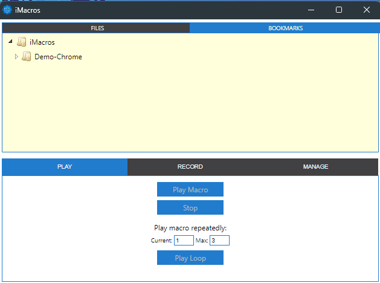
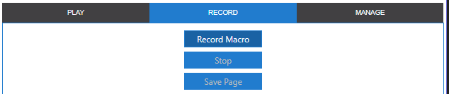
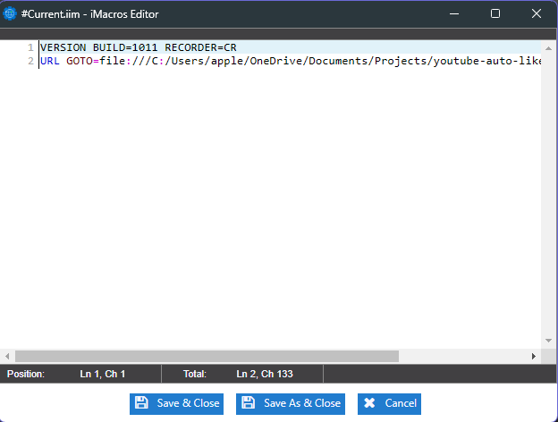
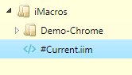

<h1 class="text-center">Youtube Auto Liker</h1>

<h3>Как пользоваться?</h3>
<ul>
  <li>
    Установите расширение <a href="https://chrome.google.com/webstore/detail/tampermonkey/dhdgffkkebhmkfjojejmpbldmpobfkfo">TamperMonkey</a>
  </li>
  <li>
    В расширении нажать "Create a new script"
  </li>
  <li>
    В открывшееся окно вставить код из файла "autoliker.user.js"
  </li>
  <li>
    Открыть любое видео на <a href="https://youtube.com">youtube</a> и лайк сразу будет поставлен
  </li>
</ul>

<h3>Как отключить расширение?</h3>

<ul>
  <li>
    В расширении нажать "Dashboard"
  </li>
  <li>
    Убрать галочку на поле "Enable"
  </li>
</ul>

<h3>Что нужно, чтобы работали ссылки через ссылку поиска?</h3>

<ul>
        <li class="mt-4">
            Установите расширение <a href="https://chrome.google.com/webstore/detail/imacros-for-chrome/cplklnmnlbnpmjogncfgfijoopmnlemp">iMacros for Chrome</a>
        </li>
        <li class="mt-4">
            Откройте расширение, откроется такое окно  
        </li>
        <li class="mt-4">
            Далее, откройте вкладку Record, и там Record macro, затем сразу нажимайте кнопку "stop"  
        </li>
        <li class="mt-4">
            У вас откроется окно, куда надо будет скопировать код из файла "dist/autolike-search.iim"   
        </li>
        <li class="mt-4">
            У вас появится новый macros в списке   
        </li>
        <li class="mt-4">
            Потом можете открывать поиск в ютубе, найти нужную вам тему, и нажать PlayLoop, а не Play, это важно!
        </li>
        <li class="mt-4">
            У вас будет 2 поля, current и max над кнопкой "Play Loop". Советую в поле max ставить 1
        </li>
    </ul>

