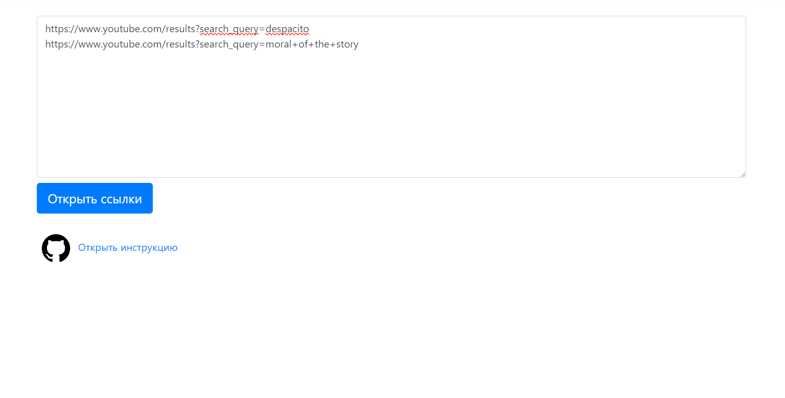

<h1 class="text-center">Youtube Auto Liker</h1>

<h3>Как пользоваться?</h3>
<ul>
  <li>
    Установите расширение <a href="https://chrome.google.com/webstore/detail/tampermonkey/dhdgffkkebhmkfjojejmpbldmpobfkfo">TamperMonkey</a>
  </li>
  <li>
    В расширении нажать "Create a new script"
  </li>
  <li>
    В открывшемся окне стереть все и вставить код из файла "dist/autoliker.user.js"(открывайте с помощью блокнота)
  </li>
  <li>
    Открыть любое видео на <a href="https://youtube.com">youtube</a> и лайк сразу будет поставлен
  </li>
</ul>

<h3>Как отключить расширение?</h3>

<ul>
  <li>
    В расширении нажать "Dashboard"
  </li>
  <li>
    Убрать галочку на поле "Enable"
  </li>
</ul>

<h3>Как начать работу?</h3>

<ul>
  <li>
    Открыть файл index.html
  </li>
  <li>
    Вставить в поле ссылки на поиск в youtube (новая ссылка должна начинаться с новой строки, мусор весь очищается)
  </li>
  <li>
    Такой вид допускается(откроется 2 ссылки на youtube):
     
  </li>
  <li>
    Запустить и отдыхать
  </li>
</ul>

